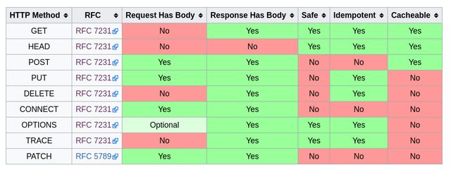

170829

# HTTP History API

[HTTP History API](https://developer.mozilla.org/ko/docs/Web/API/History_API)

## history.back()
- window.history.back();

## history.forward()
- window.history.forward();

## history.go()
- 히스토리에서 특정 위치로 가기

## history.pushState()
- 히스토리 엔트리의 추가 및 변경
- 이 메서드들은 window.onpopstate 이벤트와 연동하여 동작합니다.

# HTTP 까보기
- WireShark
  - https를 사용하는 사이트는 wireshark로 찾아볼 수 없다.
- Chrome Devtools
  - 검사탭 -> Network

## HTTP
- `웹 브라우저와 웹 서버 간의 통신을` 위해 개발된 통신규약
- 최근에는 `REST API의 부상`와 함꼐 다른 용도로도 널리 사용됨
  - 모바일 앱 - 서버 간 통신
  - 서버 - 서버 간 통신
- `80번 포트`를 기본으로 사용
- 클라이언트의 `요청(requert)`과 서버의 `응답(response)`으로 이루어짐


## HTTPS
- HTTP over SSL
- HTTP 통신을 암호화해 주고받는 내용을 중간에서 가로챌 수 없도록 함
- `443번 포트`를 기본으로 사용

## HTTP/2
- `구글의 SPDY 프로토콜`을 기반으로 2015년에 확정된 새로운 HTTP 표준
- `속도 개선`에 중점을 두고 개발됨
- `반드시 HTTPS를 사용해야 함`
- 현재 전체 웹사이트 중 16% 이상이 사용중

## HTTP 구성요소

### Request & Response
- 웹 브라우저(또는 다른 클라이언트)는 웹 서버에 요청(request)를 보냄
- 그에 따라 서버는 클라이언트에 응답(response)를 보냄
- 웹 브라우저의 경우, `HTML 문서 형태의 응답`이 오면 해당 문서를 분석한 후, `문서에 포함된 모든 자원에 대한 요청을 각각 추가로 보냄` (이미지, 동영상, 오디오, CSS, JS, 폰트, ...)

### Request Methods
- `HTTP 명세에는 8 종류`가 등록되어 있고, 각각의 역할과 충족해야 하는 성질이 명시되어 있음
  - GET, HEAD, POST, PUT, DELETE, CONNECT, OPTIONS, TRACE, PATCH
  - [HTTP request methods](https://developer.mozilla.org/ko/docs/Web/HTTP/Methods)  
- 웹 브라우저는 `특정 상황에서 특정 메소드로 요청을 보내도록 강제되어져 있음`
- Ajax와 같이 `요청을 보내는 코드를 직접 짤 때`는 요청 메소드를 선택할 수 있음
- `자료의 본문을 요청하는 GET `메소드와, `새로운 자료를 등록하는 POST` 메소드가 가장 많이 쓰임

### (서버가 충족시켜야 하는) 메소드의 성질

`Safe`
- 요청이 서버의 상태에 영향을 미치지 않아야 함. 즉, `읽기 전용`  

`Idempotent`
- 여러 번 같은 요청을 해도 한 번 요청한 것과 같은 효과여야 함. `네트워크가 불안정해도 안전하게 요청을 보낼 수 있음`

`Cacheable`
- (특정 조건을 만족하면) 응답을 클라이언트에 저장해두었다가 다음 번 요청 때 `다시 쓸 수 있음`

> fetch는 일부분만 바꿀때 사용하며, put은 전체를 바꿀때 사용한다,

## link
- 반드시 이 성질을 따르도록 서버를 구현해야 하는 것은 아니나, 구현했을 때의 이점이 있으므로 이대로 구현하는 것이 좋다



## URL

- 2,3,4는 domain영역이다.
  - 4(TOP)는 특별한 기관에서 관리를한다.


## Percent Encoding

- URL은 `ASCII 문자`(128개의 영문자+특수문자+제어문자)밖에 사용하지 못하기 때문에, non-ASCII 문자를 위한 표현방법이 필요함 #
- `Percent encoding`은 `non-ASCII 문자를 위한 웹 표준 인코딩 방법`으로, JavaScript에 관련 기능이 포함되어 있음

```bash
> encodeURIComponent("한글")
"%ED%95%9C%EA%B8%80"
> decodeURIComponent("%ED%95%9C%EA%B8%80")
"한글"
```

```js
const encoded = encodeURIComponent('패스트캠퍼스')
undefined
decodeURIComponent(encoded)
"패스트캠퍼스"
```

## Request Target

일반적인 경우 아래와 같은 구조가 사용됨

`absolute path + query string + fragment id`

```
GET /path/to/resource?foo=bar&spam=hoge#fragid HTTP/1.1
```

## Response Status

- 응답의 성공, 실패 여부와 종류를 나타내며, `상태 코드 + 상태 메시지`의 형태로 응답에 포함됨

```
HTTP/1.1 200 OK
```
[HTTP Status Codes](https://httpstatuses.com/)

## Status Category

<b>2xx</b>
  - 성공  

<b>3xx</b>
  - 추가 작업이 필요함  

<b>4xx</b>
  - 실패 - 클라이언트 책임  

<b>5xx</b>
  - 실패 - 서버 책임  

## Status Code - 2xx

<b>200</b> ok 성공

<b>201</b> Created 자료가 성공적으로 생성됨

## Status Code - 3xx

<b>301 Moved Permanently (Redirection)</b>
- 자료가 완전히 다른 곳으로 이동했음

<b>302 Found (Redirection)</b>
- 자료가 일시적으로 다른 곳에 있음

<b>304 Not Modified (Cache)</b>
- 클라이언트가 이미 가지고 있던 자료가 수정되지 않았음 (그대로 사용하면 됨)

## Status Code - 4xx

<b>400 Bad Request</b>
- 요청의 형태가 잘못되어 응답할 수 없음

<b>403 Forbidden</b>
- 요청한 자료에 접근할 권한이 없음

<b>404 Not Found</b>
- 요청한 자료가 없음

## Status Code - 5xx

<b>500 Internal Server Error</b>
- 요청을 처리하던 중에 예상치 못한 오류가 발생함

<b>503 Service Unavailable</b>
- 서버가 일시적으로 응답을 할 수 없음


## Header

- `요청과 응답`에 대한 `추가 정보`를 표현하는 데 사용됨  
- 인증, 캐싱, 쿠키, 보안, 내용협상, 프록시 등 웹 표준에 정의된 많은 `기능을 제어`하는 데 사용됨  

`Authorization`  
- 요청의 인증 정보

`User-Agent`  
- 요청 중인 클라이언트의 정보

`Location`  
- 301, 302 응답에서 자료의 위치

`Accept`  
- 요청이 어떤 형태의 자료를 원하는지 나타냄

`Content-Type`  
- 요청 혹은 응답이 어떤 형태의 자료인지 나타냄

## Content Negotiation
- 요청의 Accept, Accept-Language 등의 헤더를 보고 서버가 그에 맞는 형태의 자료를 응답하는 절차를 content negotiation(내용협상)이라고 함


