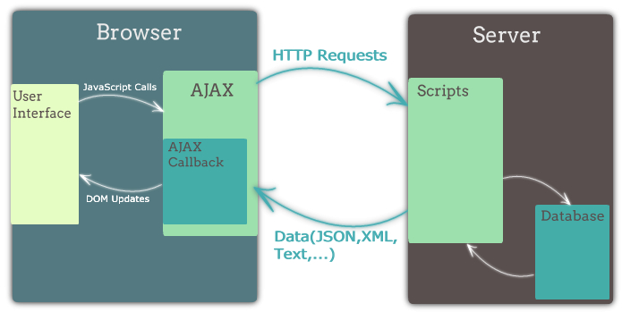

170905

# Node Ajax

## Ajax
`비동기적인 웹 어플리케이션의 제작을 위한 클라리언트 측 웹 개발 기법`
요즈음은 의미가 변형되어 `웹 브라우저`에서 `XMLHttpRequest` 혹은 `fetch`를 이용해서 보내는 `HTTP 요청`을 통칭하기도 함

## Ajax Model



## Ajax의 장점
- 화면 전체를 다시 로드하지 않고도 내용을 갱신할 수 있어 더 나은 사용자 경험 제공  
- 서버의 응답을 기다리는 동안에도 여전히 웹 어플리케이션을 사용 가능  
- 필요한 자원만 서버에서 받아오게 되므로 트래픽이 줄어듬  

## Ajax의 단점
- 클라이언트 구현이 `굉장히` 복잡해짐

## Ajax Library Comparison
Axios를 사용한다.

## Axios
- `Promise based` HTTP client  
- 브라우저와 Node.js에서 `모두 사용 가능` 
- XMLHttpRequest, fetch에 비해 사용하기 편하고 기능이 더 많음  
  - fetch는 취소가안되서 Axios를 더 사용하게된다.

## Axios + json-server 예제
[Link](https://glitch.com/edit/#!/wpsn-axios-example)

GET 자료읽기
POST 자료 생성
PUT 자료 갱신(값을 통째로 다 바꾼다 = 치환)
PATCH 자료 갱신
DELETE 삭제

- Axios는 기본적으로 json을 받는다.

```js
axios.get('/api/todos/1')
  .then(res => {
    console.log(`status code: ${res.status}`)
    console.log('headers:')
    prettyPrint(res.headers)
    console.log('data:')
    prettyPrint(res.data)
  })
```
- 상태 코드(res.status), 응답 헤더 (res.headers), 데이터

## 쿠키를 통한 인증 예제  
[Link](https://glitch.com/edit/#!/wpsn-axios-auth-example)

## Axios

Axios는 최근 인기를 끌고 있는 HTTP client입니다. 브라우저에서 사용하면 XMLHttpRequest를 사용하여 Ajax 요청을 보내고, Node.js에서 사용하면 내장 http 모듈을 이용해 요청을 보냅니다. 사용법이 아주 간단하며 Promise 기반으로 깔끔한 코드를 작성할 수 있습니다.  


상단의 Show 버튼을 누르고 개발자 도구의 콘솔을 열어 예제 코드를 입력해보세요. axios 변수가 미리 로드되어 있습니다.  

## json-server + express

이 프로젝트는 json-server 패키지를 사용해 REST API를 제공하고 있습니다. json-server는 내부적으로 express를 사용하고 있어서 커맨드라인을 통해서 json-server를 실행시키지 않고 직접 자바스크립트 파일에서 불러와 사용할 수 있습니다. 보통의 express 객체를 사용하듯이 사용할 수 있어서 필요한 경로에 미들웨어를 마음대로 추가할 수 있습니다. server.js 파일을 참고해주세요.  

```js
 
const jsonServer = require('json-server')
const fs = require('fs')
const cookieSession = require('cookie-session')
const bodyParser = require('body-parser')

// json-server의 구성요소들을 생성합니다.
const server = jsonServer.create()
const router = jsonServer.router('.data/db.json')
const middlewares = jsonServer.defaults()

// 쿠키를 glitch에서 사용하기 위해 필요한 설정입니다.
server.set('trust proxy', 1)

// cookie-session 미들웨어를 주입합니다.
server.use(cookieSession({
  name: 'session',
  secret: 'secret'
}))

// json-server가 제공하는 미들웨어를 주입합니다.
server.use(middlewares)

// 사용자 데이터를 관리할 데이터베이스가 필요한데
// json-server로 관리되는 데이터에 접근하기 어렵기 때문에
// 사용자 데이터만 아래와 같이 따로 배열로 관리합니다.
const users = [
  {username: 'fast', password: 'campus'},
  {username: 'node', password: 'js'},
  {username: 'react', password: 'facebook'}
]

// 인증을 위한 라우트 핸들러입니다.
// bodyParser.json json을 다루는 미들웨어이다.
server.post('/auth', bodyParser.json(), (req, res) => {
  const {username, password} = req.body
  // const username = req.body.username
  // const password = req.body.password
  const matched = users.find(user => user.username === username && user.password === password)
  if (matched) {
    req.session.username = username
    res.send({ok: true, data: {users}})
    // res.end()
  } else {
    res.status(400)
    res.send({ok: false, message: '400 Bad Request'})
    // res.end()
  }
})

// 로그아웃을 위한 라우트 핸들러입니다.
server.delete('/auth', (req, res) => {
  req.session = null
  res.end()
})

// `/api` 경로의 인증을 담당하는 미들웨어입니다.
function authMiddleware(req, res, next) {
  if (!req.session.username) {
    res.status(401)
    res.send('401 Unauthorized')
  } else {
    next()
  }
}

server.use('/api', authMiddleware, router)

server.listen(3000, () => {
  console.log('JSON Server is running')
})

```

## 쿠키를 통한 인증 예제

현재 authMiddleware로 인해 /api 경로로 요청을 해도 401 응답이 오는 상태입니다. /auth 경로로 인증 요청을 보낸 후, 쿠키의 변경사항을 확인하시고 /api 경로로 요청을 보내보세요. 모든 요청을 보낸 후에 로그아웃 요청을 보낸 후, 로그아웃이 잘 되었는지 확인해보세요.  

## 로그인

```js
// 로그인
axios.post('/auth', {
  username: 'fast',
  password: 'campus'
}).then(res => {
  prettyPrint(res.data)
})
```
```js
로그아웃

// 로그아웃
axios.delete('/auth')
  .then(res => {
    prettyPrint(res.data)
  })
아래부터는 이전 예제와 동일한 내용입니다.
```

```js
GET /api/todos

// GET
axios.get('/api/todos')
  .then(res => {
    prettyPrint(res.data)
  })
```

```js
POST /api/todos

// POST
axios.post('/api/todos', {title: "ajax 공부"})
  .then(res => {
    prettyPrint(res.data)
  })
```

```js
PATCH /api/todos/3

// PATCH
axios.patch('/api/todos/3', {title: "axios 공부"})
  .then(res => {
    prettyPrint(res.data)
  })
```

```js
DELETE /api/todos/3

// DELETE
axios.delete('/api/todos/3')
  .then(res => {
    prettyPrint(res.data)
  })
GET /api/todos/?title=react
```

axios 요청 메소드의 두 번째 인자로 config 객체를 넘길 수 있습니다. config 객체를 통해 요청의 쿼리 스트링, 요청 헤더, 쿠키 포함 여부 등 많은 것들을 설정할 수 있습니다.  

```js
// config 객체
axios.get('/api/todos', {
  params: { // query string
    title: 'react 공부'
  },
  headers: { // 요청 헤더
    'X-Api-Key': 'my-api-key'
  },
  timeout: 1000 // 1초 이내에 응답이 오지 않으면 에러로 간주
}).then(res => {
    prettyPrint(res.data)
  })
응답 객체
```

응답 객체를 통해 응답의 여러 정보에 접근할 수 있습니다.

```js
// config.params
axios.get('/api/todos/1')
  .then(res => {
    console.log(`status code: ${res.status}`)
    console.log('headers:')
    prettyPrint(res.headers)
    console.log('data:')
    prettyPrint(res.data)
  })
```

## Not a Number
문자열을 정수로 변경하는 방법

- *1 : undefined *1 를하면 NaN이 나오는 문제가 발생한다.
  - NaN을 판별할때는 isNaN을 사용해야한다.
- parseInt 
