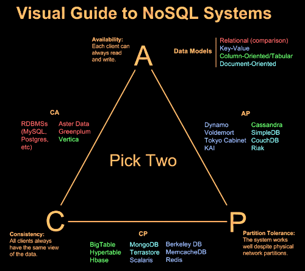

170917

# Node mongoDB

`MEAN Stack = MongoDB + Express + Angular + Node`

IT (Information Technology) 
1. 저장 : 데이터 저장소
2. 처리 : 프로그래밍 언어


## (1) MongoDB 란?

몽고DB(MongoDB)  
  - 크로스 플랫폼 : window, linux, mac 전부다 가능하다.
  - 도큐먼트(JSON과 같은 동적 스키마형 문서) 지향  
  - NoSQL 데이터베이스 시스템 : NonSQL SQL외에 다른것도 사용한다.
    - `Readys방식 => 키:값`
    - `MongoDB => 문서기반(JSON) : Java Script Object Notation`
    - BigData => 컬럼패밀리 
    - Graph

  - 오픈소스(Open Source)  
  - C++로 작성됨  
  - 높은 확장성  
  - 높은 성능  
  - 더 쉽고 더 빠르게 데이터 통합 가능  

## NoSQL  

NoSQL 데이터베이스는 전통적인 관계형 데이터베이스 보다 덜 제한적인 일관성 모델을 이용하는 데이터의 저장 및 검색을 위한 매커니즘을 제공한다.  
이러한 접근에 대한 동기에는 디자인의 단순화, 수평적 확장성, 세세한 통제를 포함한다.  
NoSQL 데이터베이스는 단순 검색 및 추가 작업을 위한 매우 최적화된 키 값 저장 공간으로, 레이턴시와 스루풋과 관련하여 상당한 성능 이익을 내는 것이 목적이다.   
NoSQL 데이터베이스는 빅데이터와 실시간 웹 애플리케이션의 상업적 이용에 널리 쓰인다.  
또, NoSQL 시스템은 SQL 계열 쿼리 언어를 사용할 수 있다는 사실을 강조한다는 면에서 "Not only SQL"로 불리기도 한다. (위키백과)

## 데이터 저장소에 대한 CAP 이론  

CAP 정리, 또는 브루어의 정리(Brewer -)는, 다음과 같은 세 가지 조건을 모두 만족하는 분산 컴퓨터 시스템이 존재하지 않음을 증명한 정리이다.  

`일관성(Consistency):` 모든 노드가 같은 순간에 같은 데이터를 볼 수 있다.  

`가용성(Availability):` 모든 요청이 성공 또는 실패 결과를 반환할 수 있다.  

`분할내성(Partition tolerance):` 메시지 전달이 실패하거나 시스템 일부가 망가져도 시스템이 계속 동작할 수 있다.  

위의 세 가지 조건의 첫 글자를 따서 `CAP 정리`라고 부른다.
2000년 전산학자 에릭 브루어가 이 명제를 가설로서 제시하였고, 2002년 세스 길버트와 낸시 린치가 이를 증명하였다.  




CAP정리에 따르면 분산 시스템이 추구하는 데이터의 특성은 세 가지 중 두가지만 보장할 수 있다.  

`CA 분류` (일관성 +가용성) : 전통적인 RDBMS. 트랜잭션.  
`CP 분류` (가용성 + 분할용인) :  구글의 BigTable, HBase 등  
`AP 분류` (가용성 + 분할용인) : Dynamo, Cassandra, MongoDB 등  

## (2) MongoDB 설치

1. mongoDB 설치
```
> brew install mongodb
```

2. data/db 폴더 생성
```
sudo mkdir -p data/db

data/db로 이동 후

sudo chown kimsejune /data/db

mongoDB를 실행시키는 명령어 : 서버의 역할을 한다.
mongod 

클라이언트의 역할 실행 명령어 

mongo 

> showdbs  // 서버, 클라이언트 정보 확인

> db.member.insert({
  "id":"hong", "email":"tpwns1088@gmail.com"
});
// mongoDB에 값을 추가하는 명령어 

> db.member.find()
// mongoDB의 member값을 찾는다.
``` 

3. GUI Tool : [RoboMongo](https://robomongo.org/download)  


## (3) 관계형 데이터베이스와 몽고디비 비교  

| RDBMS         | MongoDB       |
| --------------| ------------- |
| Database      | Database      |
| Table         | Collection    |
| Row           | Document      |
| Column        | Key           |
| Primary Key   | ObjectId(_id) |


RDBMS 명령과 MongoDB 함수 비교 >

`Insert`  
SQL          : insert into members ("name","email") values("홍길동","hong@aaa.com")  
Mongo DB     : db.members.insert({name:"hong", email:"hong@aaa.com"})  


`Select`  
SQL          : select * from members where name="홍길동"  
Mongo DB     : db.members.find({name:"홍길동"})  


`Update`  
SQL          : update members set email="hong@aaa.com" where name="홍길동"  
Mongo DB     : db.members.update( {name:"홍길동"}, {$set :{email:"hong@aaa.com"} } )  


`Delete`  
SQL          : delete from members where name="홍길동"  
Mongo DB     : db.members.remove({name:"홍길동"})  

## (4) REST API와 몽고 디비 연동 이해

| HTTP METHOD   | 역할           |  MongoDB 함수  |
| --------------| ------------- | ------------- |
| POST          | 리소스를 생성    | insert, save  |
| GET           | 리소스를 조회    | find          |
| PUT           | 리소스를 수정    | update        |
| DELETE        | 리소스를 삭제    | delete        |

## (5) MEAN 스택 미니 프로젝트

  
`MongoDB` : 문서 기반의 NoSQL 데이터베이스.  
`ExpressJS` : Node.js에서 가장 널리 쓰이는 웹 프레임워크.  
`AngularJS` : 구글에서 개발한 MVC 기반 클라이언트 측 자바스크립트 프레임워크.  
`Node`.js : 자바스크립트 엔진 기반의 웹 서버.  

> Asyncawait version이 낮은 node에서 callback hell을 방지한다.


