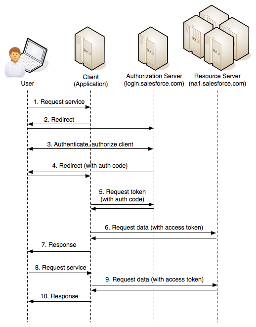

170919

# OAuth Tutorial

## WPSN OAuth 튜토리얼

최근에 웹을 사용한 경험이 있는 분들은 대부분 "페이스북으로 로그인" 버튼을 한 번 쯤 사용해보셨을 겁니다. 이 때 사용되는 인증 절차가 바로 OAuth입니다.  

OAuth가 사용되기 전에는 인증 방식의 표준이 없었기 때문에, 회사들마다 각자의 인증 방식을 사용했습니다. 이렇게 제각각이던 인증 방식을 표준화한 것이 바로 OAuth입니다. OAuth는 현재 2.0 버전까지 나와있는 상태로, 유명한 소셜 네트워크나 API 제공자들은 대부분 OAuth 2.0을 지원하고 있습니다.  

OAuth를 사용하면 `사용자의 아이디와 암호가 노출되지 않도록` 하면서도 애플리케이션에 API 접근 권한을 안전하게 위임할 수 있습니다.  

## OAuth 역할

OAuth 인증 과정에 참여하는 역할들이 아래에 나와있습니다.  

ex) Trello에 Google id로 로그인한다.
### 자원 소유자

OAuth를 통해 보호되고 있는 자원을 소유하고 있는 자원의 실제 소유자입니다. 웹 애플리케이션의 사용자입니다.
- 보통의 경우 사람을 나타낸다. google로 로그인한 `나`를 나타낸다.

### 자원 서버

사용자 소유의 자원을 제공하는 서버. API 서버라고 봐도 무방합니다.
- google 서버를 나타낸다.

### 인증 서버

소규모 서비스의 경우 자원 서버와 같은 서버에 위치해있는 경우가 많습니다.
- google 서버를 나타낸다.

### 클라이언트

OAuth를 통해 보호되고 있는 자원에 사용자 대신 접근하려고 하는 주체를 말합니다. 보통 자원 서버가 제공하는 API를 사용하려고 하는 웹 애플리케이션 서버를 가리킵니다.
- `Trello이다` why? 나를 대신해서 google 계정으로 로그인하기 때문이다.

## OAuth 2.0 Server-side Flow

OAuth 2.0에는 다양한 형태의 인증 절차가 준비되어 있습니다만, 보통 Server-side Flow 방식을 많이 사용합니다. Server-side Flow 방식의 절차는 아래 그림과 같습니다.

`Client도 Authorization Server에다가 등록을 해줘야한다.`

  

---
1. 사용자(자원 소유자)는 웹 애플리케이션(OAuth 클라이언트)에 인증 시작을 위한 요청을 보낸다.  

2. 웹 애플리케이션은 인증 서버로 사용자의 웹 브라우저를 리다이렉트 시킨다. (OAuth 클라이언트 정보가 포함됨)  

3. 사용자는 인증 서버에서 보여주는 화면을 통해 웹 애플리케이션이 요구하는 권한을 확인하고, 웹 애플리케이션이 본인 대신에 인증 정보를 활용할 수 있도록 허가한다.  

4. 인증 서버는 사용자의 웹 브라우저를 다시 웹 애플리케이션으로 리다이렉트 시킨다 (인증 코드 포함)  

5. 웹 애플리케이션은 인증 코드를 포함시킨 요청을 인증 서버에 보내고, `액세스 토큰`을 응답받는다.  

6. 웹 애플리케이션은 이제부터 액세스 토큰을 이용해 자원 서버를 사용할 수 있게 된다. 보통 가장 처음으로 사용자에 대한 정보를 가져온다.  

7. 해당 사용자 정보를 이용해 성공적으로 인증이 되었다는 사실을 사용자에게 보여준다.  

8. 사용자는 웹 애플리케이션을 `통해서` 자원 서버에 저장되어 있는 정보를 활용할 수 있게 된다.  
---

## OAuth의 구현

위에서 보셨다시피 OAuth를 통한 인증을 직접 구현하기에는 그 절차가 굉장히 복잡합니다. 다행히, 유명한 인증 제공자(Google, Facebook, Twitter 등)에 대해서는 npm에 미리 준비되어 있는 Passport strategy만 구현을 함으로써, 애플리케이션에 OAuth 인증을 쉽게 추가할 수 있습니다.
